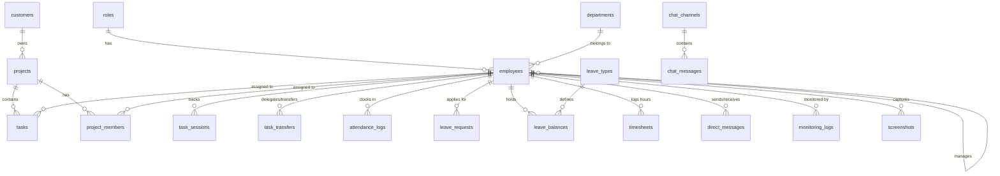

# 🗄 Enterprise EMS Database Schema (Beautified Edition)

> This edition starts with the overall architecture before the
> table-by-table schema.

# 🏗 Database Architecture

``` text
Customers
    │
Projects
    │
Workflows
    │
Tasks
    │
Task Sessions
    │
Performance Intelligence
    │
Activity Timeline
    │
Audit Trail
    │
Workload Intelligence
    │
Notifications / Chat / SLA
```

## 📦 Core Module Relationships

  Layer           Tables
  --------------- ---------------------------------------------
  Identity        roles, employees, departments
  Business        customers, projects, workflows, tasks
  Execution       task_sessions, assignments, transfers
  Intelligence    activity_events, workload, SLA
  Collaboration   chat_channels, chat_messages, notifications
  HR              attendance, leave, shifts, goals
  Analytics       reports, timesheets, monitoring

## 🔄 Data Flow

``` text
Task
 ↓
Task Session
 ↓
Performance Engine
 ↓
Activity Timeline
 ↓
Audit Trail
 ↓
Workload Heatmap
 ↓
Reports & Dashboards
```

------------------------------------------------------------------------

# Enterprise Employee Management System (EMS) --- Database Schema

This document details the PostgreSQL database architecture, schema
structure, tables, data types, primary/foreign keys, and descriptions
for all tables in the system.

------------------------------------------------------------------------

## 🗺️ Schema Overview (Modules)



------------------------------------------------------------------------

## 1. 👥 User, Role & Employee Management

### Table: `roles`

Stores application roles for access control.

  --------------------------------------------------------------------------
  Column Name       Data Type         Constraints          Description
  ----------------- ----------------- -------------------- -----------------
  `id`              `SERIAL`          `PRIMARY KEY`        Unique role ID

  `role_name`       `VARCHAR(50)`     `NOT NULL, UNIQUE`   Role title (e.g.,
                                                           Admin, Employee)
  --------------------------------------------------------------------------

------------------------------------------------------------------------

### Table: `departments`

Organization department hierarchy.

  --------------------------------------------------------------------------
  Column Name       Data Type         Constraints          Description
  ----------------- ----------------- -------------------- -----------------
  `id`              `SERIAL`          `PRIMARY KEY`        Unique department
                                                           ID

  `dept_name` /     `VARCHAR(100)`    `NOT NULL, UNIQUE`   Department name
  `name`                                                   (e.g.,
                                                           Engineering,
                                                           Admin)
  --------------------------------------------------------------------------

------------------------------------------------------------------------

### Table: `designations`

Organization job designation hierarchy.

  ------------------------------------------------------------------------------------
  Column Name       Data Type         Constraints                    Description
  ----------------- ----------------- ------------------------------ -----------------
  `id`              `SERIAL`          `PRIMARY KEY`                  Unique
                                                                     designation ID

  `title`           `VARCHAR(100)`    `NOT NULL`                     Job designation
                                                                     title

  `department_id`   `INT`             `REFERENCES departments(id)`   Associated
                                                                     department
                                                                     reference
  ------------------------------------------------------------------------------------

------------------------------------------------------------------------

### Table: `employees`

Central table for user credentials, personal details, education, and
document links.

  -----------------------------------------------------------------------------------------
  Column Name         Data Type         Constraints                       Description
  ------------------- ----------------- --------------------------------- -----------------
  `id`                `SERIAL`          `PRIMARY KEY`                     Unique employee
                                                                          ID

  `employee_code`     `VARCHAR(30)`     `UNIQUE`                          Company employee
                                                                          code
                                                                          (e.g. EMP-1001)

  `full_name`         `VARCHAR(150)`    `NOT NULL`                        Employee full
                                                                          name

  `email`             `VARCHAR(150)`    `NOT NULL, UNIQUE`                User login email

  `password`          `VARCHAR(255)`    `NOT NULL`                        Hashed password
                                                                          (bcrypt)

  `phone`             `VARCHAR(50)`     Nullable                          Phone contact
                                                                          number

  `gender`            `VARCHAR(20)`     `DEFAULT 'Female'`                Gender identity

  `dob`               `DATE`            Nullable                          Date of birth

  `citizenship`       `VARCHAR(100)`    Nullable                          Citizenship
                                                                          country

  `address`           `TEXT`            Nullable                          Current
                                                                          residential
                                                                          address

  `perm_address`      `TEXT`            Nullable                          Permanent
                                                                          residential
                                                                          address

  `emergency_name`    `VARCHAR(200)`    Nullable                          Emergency contact
                                                                          person name

  `emergency_phone`   `VARCHAR(50)`     Nullable                          Emergency contact
                                                                          phone number

  `bank_name`         `VARCHAR(150)`    Nullable                          Bank name

  `bank_acc_no`       `VARCHAR(100)`    Nullable                          Bank account
                                                                          number

  `bank_ifsc`         `VARCHAR(50)`     Nullable                          Bank IFSC code

  `profile_pic`       `VARCHAR(255)`    `DEFAULT '/default-avatar.png'`   Profile image
                                                                          path

  `role_id`           `INT`             `REFERENCES roles(id)`            User role ID

  `department_id`     `INT`             `REFERENCES departments(id)`      Department
                                                                          reference

  `designation_id`    `INT`             `REFERENCES designations(id)`     Designation
                                                                          reference

  `manager_id`        `INT`             `REFERENCES employees(id)`        Manager employee
                                                                          reference

  `is_active`         `BOOLEAN`         `DEFAULT TRUE`                    Account active
                                                                          status

  `created_at`        `TIMESTAMP`       `DEFAULT CURRENT_TIMESTAMP`       Record creation
                                                                          timestamp
  -----------------------------------------------------------------------------------------

------------------------------------------------------------------------

## 2. 🏢 Customers & SLA Management

### Table: `customers`

Stores client company profiles, SLA rules, and contract details.

  -----------------------------------------------------------------------------------------
  Column Name             Data Type         Constraints                   Description
  ----------------------- ----------------- ----------------------------- -----------------
  `id`                    `SERIAL`          `PRIMARY KEY`                 Unique customer
                                                                          ID

  `company_name`          `VARCHAR(150)`    `NOT NULL, UNIQUE`            Customer company
                                                                          name

  `code`                  `VARCHAR(20)`     `NOT NULL, UNIQUE`            Unique client
                                                                          code

  `address`               `TEXT`            Nullable                      Corporate address

  `gst_no`                `VARCHAR(100)`    Nullable                      GST Registration
                                                                          Number

  `industry`              `VARCHAR(100)`    Nullable                      Industry type

  `branches`              `JSONB`           `DEFAULT '[]'`                Branch offices
                                                                          array

  `sla_type`              `VARCHAR(50)`     Nullable                      SLA agreement
                                                                          tier (Gold,
                                                                          Silver, Bronze)

  `contract_start_date`   `DATE`            Nullable                      Contract start
                                                                          date

  `contract_end_date`     `DATE`            Nullable                      Contract expiry
                                                                          date

  `created_at`            `TIMESTAMP`       `DEFAULT CURRENT_TIMESTAMP`   Record creation
                                                                          timestamp
  -----------------------------------------------------------------------------------------

------------------------------------------------------------------------

### Table: `sla_policies`

Service Level Agreement escalation thresholds and guarantees.

  -----------------------------------------------------------------------------
  Column Name             Data Type         Constraints       Description
  ----------------------- ----------------- ----------------- -----------------
  `id`                    `SERIAL`          `PRIMARY KEY`     Unique policy ID

  `policy_name`           `VARCHAR(100)`    `NOT NULL`        SLA policy name

  `priority`              `VARCHAR(30)`     `NOT NULL`        Target priority
                                                              (Urgent, High,
                                                              Normal)

  `business_hours_only`   `BOOLEAN`         `DEFAULT true`    Business hours
                                                              calculation flag

  `level1_mins`           `INT`             `DEFAULT 30`      L1 Escalation
                                                              time (minutes)

  `level2_mins`           `INT`             `DEFAULT 60`      L2 Escalation
                                                              time (minutes)

  `level3_mins`           `INT`             `DEFAULT 120`     L3 Escalation
                                                              time (minutes)

  `is_active`             `BOOLEAN`         `DEFAULT true`    Active policy
                                                              flag
  -----------------------------------------------------------------------------

------------------------------------------------------------------------

## 3. 📋 Projects & Workflows

### Table: `projects`

Stores project records linked to customers and account managers.

  ----------------------------------------------------------------------------------------
  Column Name            Data Type         Constraints                   Description
  ---------------------- ----------------- ----------------------------- -----------------
  `id`                   `SERIAL`          `PRIMARY KEY`                 Unique project ID

  `project_name`         `VARCHAR(150)`    `NOT NULL`                    Name of the
                                                                         project

  `description`          `TEXT`            Nullable                      Project scope and
                                                                         details

  `customer_id`          `INT`             `REFERENCES customers(id)`    Client owner

  `branch_name`          `VARCHAR(150)`    Nullable                      Target customer
                                                                         branch

  `account_manager_id`   `INT`             `REFERENCES employees(id)`    Account manager
                                                                         in charge

  `start_date`           `DATE`            Nullable                      Project start
                                                                         date

  `end_date`             `DATE`            Nullable                      Target end date

  `status`               `VARCHAR(50)`     `DEFAULT 'In Progress'`       Status (In
                                                                         Progress,
                                                                         Completed, etc.)

  `created_at`           `TIMESTAMP`       `DEFAULT CURRENT_TIMESTAMP`   Record creation
                                                                         timestamp
  ----------------------------------------------------------------------------------------

------------------------------------------------------------------------

### Table: `project_members`

Junction table mapping employees assigned to projects.

  -----------------------------------------------------------------------------------------------
  Column Name       Data Type         Constraints                               Description
  ----------------- ----------------- ----------------------------------------- -----------------
  `project_id`      `INT`             `PRIMARY KEY, REFERENCES projects(id)`    Foreign key to
                                                                                project

  `employee_id`     `INT`             `PRIMARY KEY, REFERENCES employees(id)`   Foreign key to
                                                                                assigned employee
  -----------------------------------------------------------------------------------------------

------------------------------------------------------------------------

### Table: `workflows`

Master project workflow definitions.

  --------------------------------------------------------------------------------------
  Column Name           Data Type         Constraints                  Description
  --------------------- ----------------- ---------------------------- -----------------
  `id`                  `SERIAL`          `PRIMARY KEY`                Unique workflow
                                                                       ID

  `name`                `VARCHAR(255)`    `NOT NULL`                   Workflow title

  `customer_id`         `INT`             `REFERENCES customers(id)`   Customer
                                                                       reference

  `project_id`          `INT`             `REFERENCES projects(id)`    Project reference

  `status`              `VARCHAR(50)`     `DEFAULT 'Planning'`         Planning, In
                                                                       Progress,
                                                                       Completed

  `target_completion`   `DATE`            Nullable                     Target completion
                                                                       date

  `created_at`          `TIMESTAMP`       `DEFAULT NOW()`              Creation
                                                                       timestamp
  --------------------------------------------------------------------------------------

------------------------------------------------------------------------

### Table: `workflow_teams`

Teams assigned to workflow execution.

  ----------------------------------------------------------------------------------------------------
  Column Name       Data Type         Constraints                                    Description
  ----------------- ----------------- ---------------------------------------------- -----------------
  `id`              `SERIAL`          `PRIMARY KEY`                                  Unique team ID

  `workflow_id`     `INT`             `REFERENCES workflows(id) ON DELETE CASCADE`   Parent workflow

  `name`            `VARCHAR(180)`    `NOT NULL`                                     Team name

  `lead_id`         `INT`             `REFERENCES employees(id)`                     Team Lead
                                                                                     employee ID

  `member_ids`      `INT[]`           `DEFAULT '{}'`                                 Array of assigned
                                                                                     employee IDs
  ----------------------------------------------------------------------------------------------------

------------------------------------------------------------------------

### Table: `workflow_tasks`

Granular sequential steps within a workflow.

  ------------------------------------------------------------------------------------------------------
  Column Name         Data Type         Constraints                                    Description
  ------------------- ----------------- ---------------------------------------------- -----------------
  `id`                `SERIAL`          `PRIMARY KEY`                                  Unique workflow
                                                                                       task ID

  `workflow_id`       `INT`             `REFERENCES workflows(id) ON DELETE CASCADE`   Parent workflow
                                                                                       ID

  `step_order`        `INT`             `DEFAULT 1`                                    Execution
                                                                                       sequence order

  `name`              `VARCHAR(255)`    `NOT NULL`                                     Task step name

  `estimated_hours`   `NUMERIC(6,2)`    Nullable                                       Estimated effort
                                                                                       hours

  `status`            `VARCHAR(50)`     `DEFAULT 'Not Started'`                        Task execution
                                                                                       status
  ------------------------------------------------------------------------------------------------------

------------------------------------------------------------------------

## 4. ⚡ Task Engine, Live Tracking & Handover

### Table: `tasks`

Individual task assignments within projects.

  --------------------------------------------------------------------------------------
  Column Name          Data Type         Constraints                   Description
  -------------------- ----------------- ----------------------------- -----------------
  `id`                 `SERIAL`          `PRIMARY KEY`                 Unique task ID

  `title` /            `VARCHAR(255)`    `NOT NULL`                    Task title
  `task_name`                                                          

  `description`        `TEXT`            Nullable                      Detailed
                                                                       instructions

  `project_id`         `INT`             `REFERENCES projects(id)`     Associated
                                                                       project

  `assigned_to`        `INT`             `REFERENCES employees(id)`    Primary assignee
                                                                       employee

  `due_date`           `DATE`            Nullable                      Deadline

  `priority`           `VARCHAR(20)`     `DEFAULT 'Medium'`            Priority level
                                                                       (Low, Medium,
                                                                       High, Urgent)

  `status`             `VARCHAR(50)`     `DEFAULT 'To Do'`             Current execution
                                                                       status

  `progress_percent`   `INT`             `DEFAULT 0`                   Completion
                                                                       percentage
                                                                       (0-100%)

  `created_at`         `TIMESTAMP`       `DEFAULT CURRENT_TIMESTAMP`   Record creation
                                                                       timestamp
  --------------------------------------------------------------------------------------

------------------------------------------------------------------------

### Table: `task_sessions`

Live real-time task tracking timer sessions.

  ----------------------------------------------------------------------------------------------------
  Column Name           Data Type         Constraints                                Description
  --------------------- ----------------- ------------------------------------------ -----------------
  `id`                  `SERIAL`          `PRIMARY KEY`                              Unique session ID

  `task_id`             `INT`             `REFERENCES tasks(id) ON DELETE CASCADE`   Tracked task
                                                                                     reference

  `employee_id`         `INT`             `REFERENCES employees(id)`                 Operator employee
                                                                                     reference

  `status`              `VARCHAR(30)`     `DEFAULT 'Running'`                        Status (Running,
                                                                                     Paused, Auto
                                                                                     Paused,
                                                                                     Completed)

  `started_at`          `TIMESTAMP`       `DEFAULT NOW()`                            Session start
                                                                                     timestamp

  `last_heartbeat_at`   `TIMESTAMP`       `DEFAULT NOW()`                            Last active
                                                                                     client heartbeat
                                                                                     timestamp

  `duration_seconds`    `INT`             `DEFAULT 0`                                Total seconds
                                                                                     tracked in
                                                                                     session
  ----------------------------------------------------------------------------------------------------

------------------------------------------------------------------------

### Table: `task_session_events`

Audit event logs for task timer operations (Pause, Heartbeat Lost,
Resume).

  --------------------------------------------------------------------------------------------------------
  Column Name       Data Type         Constraints                                        Description
  ----------------- ----------------- -------------------------------------------------- -----------------
  `id`              `SERIAL`          `PRIMARY KEY`                                      Unique event ID

  `session_id`      `INT`             `REFERENCES task_sessions(id) ON DELETE CASCADE`   Session ID

  `employee_id`     `INT`             `REFERENCES employees(id)`                         Employee ID

  `event_type`      `VARCHAR(50)`     `NOT NULL`                                         Event type
                                                                                         (Pause, Heartbeat
                                                                                         Lost, Resume)

  `reason`          `VARCHAR(255)`    Nullable                                           Event trigger
                                                                                         reason

  `created_at`      `TIMESTAMP`       `DEFAULT NOW()`                                    Event timestamp
  --------------------------------------------------------------------------------------------------------

------------------------------------------------------------------------

### Table: `task_assignments`

Tracks primary and secondary active ownership assignments on tasks.

  ------------------------------------------------------------------------------------------------
  Column Name       Data Type         Constraints                                Description
  ----------------- ----------------- ------------------------------------------ -----------------
  `id`              `SERIAL`          `PRIMARY KEY`                              Assignment ID

  `task_id`         `INT`             `REFERENCES tasks(id) ON DELETE CASCADE`   Task ID

  `assignee_type`   `VARCHAR(30)`     `DEFAULT 'Employee'`                       Assignee type
                                                                                 (Employee, Team)

  `assignee_id`     `INT`             `NOT NULL`                                 Assignee Employee
                                                                                 or Team ID

  `role`            `VARCHAR(30)`     `DEFAULT 'Primary'`                        Assignment role
                                                                                 (Primary,
                                                                                 Delegated)

  `assigned_by`     `INT`             `REFERENCES employees(id)`                 Assignor employee
                                                                                 ID

  `is_active`       `BOOLEAN`         `DEFAULT true`                             Active assignment
                                                                                 flag

  `assigned_at`     `TIMESTAMP`       `DEFAULT NOW()`                            Assignment
                                                                                 timestamp
  ------------------------------------------------------------------------------------------------

------------------------------------------------------------------------

### Table: `task_transfers`

Tracks task ownership transfers, delegations, and approval workflow.

  ---------------------------------------------------------------------------------------
  Column Name          Data Type         Constraints                    Description
  -------------------- ----------------- ------------------------------ -----------------
  `id`                 `SERIAL`          `PRIMARY KEY`                  Unique transfer
                                                                        ID

  `task_id`            `INT`             `REFERENCES tasks(id)`         Target task ID

  `from_employee_id`   `INT`             `REFERENCES employees(id)`     Current owner
                                                                        employee ID

  `to_employee_id`     `INT`             `REFERENCES employees(id)`     Target owner
                                                                        employee ID

  `transfer_type`      `VARCHAR(30)`     `NOT NULL`                     Transfer type
                                                                        (Transfer,
                                                                        Delegation)

  `status`             `VARCHAR(30)`     `DEFAULT 'Pending Approval'`   Approval status
                                                                        (Pending
                                                                        Approval,
                                                                        Approved,
                                                                        Rejected,
                                                                        Expired)

  `expiry_at`          `TIMESTAMP`       Nullable                       Delegation expiry
                                                                        timestamp

  `created_at`         `TIMESTAMP`       `DEFAULT NOW()`                Creation
                                                                        timestamp
  ---------------------------------------------------------------------------------------

------------------------------------------------------------------------

### Table: `task_assignment_history`

Complete immutable audit trail of all task ownership changes.

  ------------------------------------------------------------------------------------------------
  Column Name       Data Type         Constraints                                Description
  ----------------- ----------------- ------------------------------------------ -----------------
  `id`              `SERIAL`          `PRIMARY KEY`                              History ID

  `task_id`         `INT`             `REFERENCES tasks(id) ON DELETE CASCADE`   Task ID

  `action`          `VARCHAR(50)`     `NOT NULL`                                 Action (ASSIGNED,
                                                                                 TRANSFERRED,
                                                                                 DELEGATED,
                                                                                 RETURNED)

  `old_owner_id`    `INT`             Nullable                                   Previous owner
                                                                                 employee ID

  `new_owner_id`    `INT`             Nullable                                   New owner
                                                                                 employee ID

  `performed_by`    `INT`             `REFERENCES employees(id)`                 Employee
                                                                                 executing action

  `created_at`      `TIMESTAMP`       `DEFAULT NOW()`                            Record timestamp
  ------------------------------------------------------------------------------------------------

------------------------------------------------------------------------

## 5. 💬 Real-Time Chat Rooms & Direct Messaging

### Table: `direct_messages`

Stores 1-on-1 direct messages between employees with file attachment
support (Photos, PDFs, ZIPs, Docs).

  ------------------------------------------------------------------------------------------------------
  Column Name       Data Type         Constraints                  Description
  ----------------- ----------------- ---------------------------- -------------------------------------
  `id`              `SERIAL`          `PRIMARY KEY`                Unique message ID

  `sender_id`       `INT`             `REFERENCES employees(id)`   Sender employee ID

  `recipient_id`    `INT`             `REFERENCES employees(id)`   Recipient employee ID

  `message`         `TEXT`            `NOT NULL`                   Text body of the message

  `file_url`        `TEXT`            Nullable                     Uploaded file URL
                                                                   (e.g. `/uploads/chat/173-file.pdf`)

  `file_name`       `VARCHAR(255)`    Nullable                     Original uploaded filename

  `file_type`       `VARCHAR(100)`    Nullable                     File MIME type (image/png,
                                                                   application/pdf, application/zip)

  `file_size`       `BIGINT`          Nullable                     File size in bytes

  `created_at`      `TIMESTAMP`       `DEFAULT NOW()`              Sent timestamp
  ------------------------------------------------------------------------------------------------------

------------------------------------------------------------------------

### Table: `chat_channels`

Task groups and department channels for team collaboration.

  ----------------------------------------------------------------------------------------
  Column Name       Data Type         Constraints                    Description
  ----------------- ----------------- ------------------------------ ---------------------
  `id`              `SERIAL`          `PRIMARY KEY`                  Unique channel ID

  `channel_type`    `VARCHAR(30)`     `NOT NULL`                     Channel type
                                                                     (TaskGroup,
                                                                     Department, General)

  `name`            `VARCHAR(100)`    `NOT NULL`                     Channel title
                                                                     (e.g. #Engineering,
                                                                     Task #402)

  `task_id`         `INT`             `REFERENCES tasks(id)`         Associated task ID

  `department_id`   `INT`             `REFERENCES departments(id)`   Associated department
                                                                     ID

  `is_pinned`       `BOOLEAN`         `DEFAULT false`                Is channel pinned

  `created_at`      `TIMESTAMP`       `DEFAULT NOW()`                Creation timestamp
  ----------------------------------------------------------------------------------------

------------------------------------------------------------------------

### Table: `chat_messages`

Messages posted inside team channels with `@mentions` and JSON file
attachments.

  ----------------------------------------------------------------------------------------------------------------------
  Column Name       Data Type         Constraints                                        Description
  ----------------- ----------------- -------------------------------------------------- -------------------------------
  `id`              `SERIAL`          `PRIMARY KEY`                                      Unique message ID

  `channel_id`      `INT`             `REFERENCES chat_channels(id) ON DELETE CASCADE`   Channel ID

  `sender_id`       `INT`             `REFERENCES employees(id)`                         Sender employee ID

  `message_type`    `VARCHAR(30)`     `DEFAULT 'TEXT'`                                   Message type (TEXT, FILE,
                                                                                         SYSTEM)

  `message_text`    `TEXT`            `NOT NULL`                                         Message body text

  `mentions`        `JSONB`           `DEFAULT '[]'`                                     Tagged employee IDs in JSON

  `attachments`     `JSONB`           `DEFAULT '[]'`                                     Attachment metadata array in
                                                                                         JSON
                                                                                         (`[{url, name, type, size}]`)

  `created_at`      `TIMESTAMP`       `DEFAULT NOW()`                                    Creation timestamp
  ----------------------------------------------------------------------------------------------------------------------

------------------------------------------------------------------------

## 6. ⏰ Attendance, Roster Shifts & Leave Management

### Table: `attendance_logs`

Daily employee clock-in and clock-out logs.

  --------------------------------------------------------------------------------------
  Column Name           Data Type         Constraints                  Description
  --------------------- ----------------- ---------------------------- -----------------
  `id`                  `SERIAL`          `PRIMARY KEY`                Unique log ID

  `employee_id`         `INT`             `REFERENCES employees(id)`   Employee
                                                                       reference

  `work_date`           `DATE`            `NOT NULL`                   Attendance date

  `clock_in`            `TIMESTAMP`       Nullable                     Time clock in
                                                                       recorded

  `clock_out`           `TIMESTAMP`       Nullable                     Time clock out
                                                                       recorded

  `correction_status`   `VARCHAR(50)`     `DEFAULT 'Approved'`         Pending,
                                                                       Approved,
                                                                       Rejected

  `approved_by`         `INT`             `REFERENCES employees(id)`   Manager approving
                                                                       correction

  `created_at`          `TIMESTAMP`       `DEFAULT NOW()`              Creation
                                                                       timestamp
  --------------------------------------------------------------------------------------

------------------------------------------------------------------------

### Table: `shifts`

Master list of working shift definitions.

  --------------------------------------------------------------------------
  Column Name       Data Type         Constraints          Description
  ----------------- ----------------- -------------------- -----------------
  `id`              `SERIAL`          `PRIMARY KEY`        Unique shift ID

  `shift_name`      `VARCHAR(50)`     `NOT NULL, UNIQUE`   Name (e.g. Day
                                                           Shift, Night
                                                           Shift)

  `start_time`      `TIME`            `NOT NULL`           Shift start time

  `end_time`        `TIME`            `NOT NULL`           Shift end time
  --------------------------------------------------------------------------

------------------------------------------------------------------------

### Table: `employee_shifts` / `shift_assignments`

Bulk roster shift schedule mappings.

  Column Name        Data Type   Constraints                  Description
  ------------------ ----------- ---------------------------- ---------------
  `id`               `SERIAL`    `PRIMARY KEY`                Roster ID
  `employee_id`      `INT`       `REFERENCES employees(id)`   Employee ID
  `shift_id`         `INT`       `REFERENCES shifts(id)`      Shift ID
  `effective_from`   `DATE`      `NOT NULL`                   Schedule date

------------------------------------------------------------------------

### Table: `leave_types`

Master configurations for allowed leave categories.

  ----------------------------------------------------------------------------
  Column Name         Data Type         Constraints          Description
  ------------------- ----------------- -------------------- -----------------
  `id`                `SERIAL`          `PRIMARY KEY`        Unique leave type
                                                             ID

  `name`              `VARCHAR(100)`    `NOT NULL, UNIQUE`   Annual, Sick,
                                                             Casual, etc.

  `code`              `VARCHAR(10)`     Nullable             Short code (AL,
                                                             SL, CL)

  `default_balance`   `NUMERIC(5,1)`    `DEFAULT 15`         Default annual
                                                             allocation days

  `carry_forward`     `BOOLEAN`         `DEFAULT false`      Is unused leave
                                                             carried forward

  `is_active`         `BOOLEAN`         `DEFAULT true`       Policy active
                                                             status

  `created_at`        `TIMESTAMP`       `DEFAULT NOW()`      Creation
                                                             timestamp
  ----------------------------------------------------------------------------

------------------------------------------------------------------------

### Table: `leave_balances`

Per-employee allocated balance tracker.

  ------------------------------------------------------------------------------------
  Column Name       Data Type         Constraints                    Description
  ----------------- ----------------- ------------------------------ -----------------
  `id`              `SERIAL`          `PRIMARY KEY`                  Unique balance ID

  `employee_id`     `INT`             `REFERENCES employees(id)`     Target employee

  `leave_type_id`   `INT`             `REFERENCES leave_types(id)`   Target leave
                                                                     policy

  `balance`         `NUMERIC(5,1)`    `DEFAULT 0`                    Remaining leave
                                                                     days available

  `used`            `NUMERIC(5,1)`    `DEFAULT 0`                    Total days
                                                                     consumed

  `created_at`      `TIMESTAMP`       `DEFAULT NOW()`                Creation
                                                                     timestamp

  `updated_at`      `TIMESTAMP`       `DEFAULT NOW()`                Last update
                                                                     timestamp
  ------------------------------------------------------------------------------------

------------------------------------------------------------------------

### Table: `leave_requests`

Employee leave application requests.

  ---------------------------------------------------------------------------------------------
  Column Name       Data Type         Constraints                             Description
  ----------------- ----------------- --------------------------------------- -----------------
  `id`              `SERIAL`          `PRIMARY KEY`                           Unique leave
                                                                              request ID

  `employee_id`     `INT`             `REFERENCES employees(id)`              Applicant
                                                                              employee

  `leave_type`      `VARCHAR(50)`     `NOT NULL`                              Type of leave
                                                                              requested

  `start_date`      `DATE`            `NOT NULL`                              Leave start date

  `end_date`        `DATE`            `NOT NULL`                              Leave end date

  `reason`          `TEXT`            Nullable                                Reason for leave

  `status`          `VARCHAR(50)`     `CHECK (Pending, Approved, Rejected)`   Approval status

  `approved_by`     `INT`             `REFERENCES employees(id)`              Approver manager
                                                                              ID

  `created_at`      `TIMESTAMP`       `DEFAULT CURRENT_TIMESTAMP`             Application
                                                                              timestamp
  ---------------------------------------------------------------------------------------------

------------------------------------------------------------------------

## 7. 📊 Reports, Timesheets & Capacity Settings

### Table: `timesheets`

Daily billable & non-billable work hours logged by employees.

  ---------------------------------------------------------------------------------------------
  Column Name       Data Type         Constraints                             Description
  ----------------- ----------------- --------------------------------------- -----------------
  `id`              `SERIAL`          `PRIMARY KEY`                           Unique timesheet
                                                                              ID

  `employee_id`     `INT`             `REFERENCES employees(id)`              Employee ID

  `work_date`       `DATE`            `NOT NULL`                              Work log date

  `hours`           `NUMERIC(4,2)`    `NOT NULL`                              Hours logged
                                                                              (e.g. 7.50)

  `description`     `TEXT`            Nullable                                Task details
                                                                              executed

  `category`        `VARCHAR(50)`     `CHECK (Billable, Non-Billable)`        Work category

  `status`          `VARCHAR(50)`     `CHECK (Pending, Approved, Rejected)`   Manager approval
                                                                              status

  `approved_by`     `INT`             `REFERENCES employees(id)`              Manager ID who
                                                                              approved

  `created_at`      `TIMESTAMP`       `DEFAULT CURRENT_TIMESTAMP`             Creation
                                                                              timestamp
  ---------------------------------------------------------------------------------------------

------------------------------------------------------------------------

### Table: `employee_capacity_settings`

Configured weekly capacity hours per employee for workload heatmaps.

  -------------------------------------------------------------------------------------------------------
  Column Name               Data Type         Constraints                               Description
  ------------------------- ----------------- ----------------------------------------- -----------------
  `employee_id`             `INT`             `PRIMARY KEY, REFERENCES employees(id)`   Employee ID

  `weekly_capacity_hours`   `NUMERIC(6,2)`    `DEFAULT 40.00`                           Target weekly
                                                                                        capacity hours

  `updated_at`              `TIMESTAMP`       `DEFAULT NOW()`                           Update timestamp
  -------------------------------------------------------------------------------------------------------

------------------------------------------------------------------------

### Table: `goals`

Performance OKRs & Key Goals per employee.

  -------------------------------------------------------------------------------------
  Column Name          Data Type         Constraints                  Description
  -------------------- ----------------- ---------------------------- -----------------
  `id`                 `SERIAL`          `PRIMARY KEY`                Unique goal ID

  `employee_id`        `INT`             `REFERENCES employees(id)`   Employee ID

  `goal_title`         `VARCHAR(255)`    `NOT NULL`                   Title of the
                                                                      objective

  `weightage`          `INT`             `NOT NULL`                   Weightage score
                                                                      (out of 100)

  `progress_percent`   `INT`             `DEFAULT 0`                  Achieved
                                                                      percentage
                                                                      (0-100%)

  `target_date`        `DATE`            Nullable                     Target date
  -------------------------------------------------------------------------------------

------------------------------------------------------------------------

### Table: `self_reports`

Daily EOD work summary submission.

  Column Name        Data Type     Constraints                  Description
  ------------------ ------------- ---------------------------- -----------------------------
  `id`               `SERIAL`      `PRIMARY KEY`                Unique report ID
  `employee_id`      `INT`         `REFERENCES employees(id)`   Employee ID
  `date`             `DATE`        `DEFAULT CURRENT_DATE`       Report date
  `todays_work`      `TEXT`        Nullable                     What was done today
  `tomorrows_plan`   `TEXT`        Nullable                     Plan for tomorrow
  `current_issues`   `TEXT`        Nullable                     Blockers / Support required
  `created_at`       `TIMESTAMP`   `DEFAULT NOW()`              Submission timestamp

------------------------------------------------------------------------

### Table: `dsr_reports`

Daily Status Report for Client / Site visits.

  -----------------------------------------------------------------------------------
  Column Name        Data Type         Constraints                  Description
  ------------------ ----------------- ---------------------------- -----------------
  `id`               `SERIAL`          `PRIMARY KEY`                Unique DSR ID

  `employee_id`      `INT`             `REFERENCES employees(id)`   Field employee ID

  `customer_name`    `VARCHAR(200)`    `NOT NULL`                   Customer /
                                                                    Company visited

  `office_address`   `TEXT`            Nullable                     Office address
                                                                    visited

  `site_name`        `VARCHAR(200)`    Nullable                     Specific site /
                                                                    project location

  `contact_person`   `VARCHAR(200)`    Nullable                     Person met at
                                                                    site

  `contact_no`       `VARCHAR(30)`     Nullable                     Contact phone
                                                                    number

  `visited_for`      `TEXT`            Nullable                     Purpose of visit

  `created_at`       `TIMESTAMP`       `DEFAULT NOW()`              Visit log
                                                                    timestamp
  -----------------------------------------------------------------------------------

------------------------------------------------------------------------

## 8. 💻 Activity Monitoring & Security Logs

### Table: `monitoring_logs`

Tracks keyboard, mouse activity, and active desktop windows.

  --------------------------------------------------------------------------------------
  Column Name          Data Type         Constraints                   Description
  -------------------- ----------------- ----------------------------- -----------------
  `id`                 `SERIAL`          `PRIMARY KEY`                 Unique log ID

  `employee_id`        `INT`             `REFERENCES employees(id)`    Employee ID

  `log_time`           `TIMESTAMP`       `DEFAULT CURRENT_TIMESTAMP`   Time of activity
                                                                       sample

  `keyboard_strokes`   `INT`             `DEFAULT 0`                   Key press count

  `mouse_clicks`       `INT`             `DEFAULT 0`                   Mouse click count

  `active_window`      `VARCHAR(255)`    Nullable                      Title of
                                                                       foreground
                                                                       application
  --------------------------------------------------------------------------------------

------------------------------------------------------------------------

### Table: `screenshots`

Screen captures taken during work hours.

  -----------------------------------------------------------------------------------
  Column Name       Data Type         Constraints                   Description
  ----------------- ----------------- ----------------------------- -----------------
  `id`              `SERIAL`          `PRIMARY KEY`                 Unique screenshot
                                                                    ID

  `employee_id`     `INT`             `REFERENCES employees(id)`    Employee ID

  `captured_at`     `TIMESTAMP`       `DEFAULT CURRENT_TIMESTAMP`   Screenshot
                                                                    capture time

  `file_path`       `VARCHAR(255)`    `NOT NULL`                    File path / URL
                                                                    of captured image
  -----------------------------------------------------------------------------------

------------------------------------------------------------------------

### Table: `activity_events`

Immutable real-time audit stream with business impact classification.

  ----------------------------------------------------------------------------------
  Column Name       Data Type         Constraints                  Description
  ----------------- ----------------- ---------------------------- -----------------
  `id`              `SERIAL`          `PRIMARY KEY`                Event ID

  `event_type`      `VARCHAR(100)`    `NOT NULL`                   Event action name

  `category`        `VARCHAR(50)`     `NOT NULL`                   Category (Task,
                                                                   Attendance,
                                                                   Security)

  `severity`        `VARCHAR(20)`     `DEFAULT 'Info'`             Info, Warning,
                                                                   Critical

  `performed_by`    `INT`             `REFERENCES employees(id)`   User who
                                                                   triggered event

  `created_at`      `TIMESTAMP`       `DEFAULT NOW()`              Immutable log
                                                                   timestamp
  ----------------------------------------------------------------------------------

------------------------------------------------------------------------

### Table: `notifications`

In-app notifications for users.

  --------------------------------------------------------------------------------------
  Column Name       Data Type         Constraints                      Description
  ----------------- ----------------- -------------------------------- -----------------
  `id`              `SERIAL`          `PRIMARY KEY`                    Unique
                                                                       notification ID

  `title`           `VARCHAR(300)`    `NOT NULL`                       Notification
                                                                       title

  `message`         `TEXT`            Nullable                         Full message body

  `type`            `VARCHAR(50)`     `DEFAULT 'Info'`                 Info, Warning,
                                                                       Success, Chat

  `recipient_id`    `INT`             `REFERENCES employees(id)`       Target employee

  `sender_id`       `INT`             `REFERENCES employees(id)`       Sender employee
                                                                       ID

  `channel_id`      `INT`             `REFERENCES chat_channels(id)`   Linked chat
                                                                       channel ID

  `is_read`         `BOOLEAN`         `DEFAULT false`                  Read status

  `created_at`      `TIMESTAMP`       `DEFAULT NOW()`                  Sent timestamp
  --------------------------------------------------------------------------------------

------------------------------------------------------------------------

## 13. ⚙️ System Configuration & Automated WhatsApp Messaging (`settings.json`)

Persistent system configuration schema stored in `backend/config/settings.json` and updated dynamically via Admin Settings (`PUT /api/v1/admin/settings`).

### Schema Definition & Data Structure:

```json
{
  "company": {
    "name": "PCS Corporation",
    "email": "admin@pcscorp.com",
    "address": "100 Innovation Way, Tech District",
    "timezone": "UTC",
    "currency": "USD"
  },
  "smtp": {
    "host": "smtp.mailtrap.io",
    "port": 2525,
    "user": "smtpuser",
    "pass": "",
    "sender": "noreply@pcscorp.com"
  },
  "preferences": {
    "standardHours": 8,
    "gracePeriod": 15,
    "workingDays": [1, 2, 3, 4, 5, 6]
  },
  "ipWhitelist": "127.0.0.1, ::1",
  "whatsappTemplate": {
    "message": "Hello {customer_name},\n\nThis is an official communication from PCS Enterprise Suite regarding {company_name}.\n\nPlease find the requested document attached.\n\nBest regards,\nPCS Admin Team",
    "attachmentUrl": "/uploads/whatsapp/wa-attachment-1785134864999.pdf",
    "attachmentName": "company_brochure.pdf"
  }
}
```

### Dynamic Placeholders Supported in Automated WhatsApp Messages:

| Placeholder | Replaced Data Source | Example Substituted Output |
| :--- | :--- | :--- |
| `{customer_name}` | Primary Contact Person Name | `Malhar Madhukar Kulkarni` |
| `{company_name}` | Customer Company Name | `PCS Enterprise Ltd` |
| `{phone}` | Customer Phone Contact | `+91 7028386535` |
| `{sla}` | SLA & Contract Settings | `Enterprise (Resp: 2h, Reso: 48h)` |

### File Storage Location:
- Uploaded WhatsApp attachment files are stored in `backend/uploads/whatsapp/` with max file size limit of 25MB (supported formats: PDF, ZIP, RAR, DOCX, XLSX, Images).

------------------------------------------------------------------------

## 14. 🎧 Support Desk Module Schema (Post-Delivery Maintenance Lifecycle)

Decoupled post-delivery issue management, SLA deadlines, conversion pipeline, public conversation & internal notes.

### Table: `support_tickets`

| Column Name | Data Type | Constraints | Description |
| :--- | :--- | :--- | :--- |
| `id` | `SERIAL` | `PRIMARY KEY` | Unique ticket ID |
| `ticket_code` | `VARCHAR(30)` | `NOT NULL, UNIQUE` | Unique ticket reference code (e.g., `SUP-000101`) |
| `customer_id` | `INT` | `REFERENCES customers(id)` | Associated customer account |
| `project_id` | `INT` | `REFERENCES projects(id)` | Linked project (optional) |
| `workflow_id` | `INT` | `REFERENCES workflows(id)` | Linked workflow (optional, populated on conversion) |
| `task_id` | `INT` | `REFERENCES workflow_tasks(id)` | Linked task (optional, populated on conversion) |
| `reported_by` | `VARCHAR(150)` | Nullable | Contact person or reporter name |
| `title` | `VARCHAR(255)` | `NOT NULL` | Issue title / summary |
| `description` | `TEXT` | Nullable | Full details & reproduction steps |
| `category` | `VARCHAR(50)` | `DEFAULT 'Bug'` | Issue category (Bug, Feature Request, Configuration, Training, Data Issue, Performance, Security, Billing, General Question) |
| `priority` | `VARCHAR(20)` | `DEFAULT 'Medium'` | Priority level (Critical, High, Medium, Low) |
| `status` | `VARCHAR(30)` | `DEFAULT 'Open'` | Current status (Open, Assigned, In Progress, Waiting Customer, Resolved, Closed) |
| `assigned_to` | `INT` | `REFERENCES employees(id)` | Assigned staff ID |
| `response_deadline` | `TIMESTAMP` | Nullable | Calculated SLA response deadline |
| `resolution_deadline` | `TIMESTAMP` | Nullable | Calculated SLA resolution deadline |
| `responded_at` | `TIMESTAMP` | Nullable | Timestamp when first responded |
| `resolved_at` | `TIMESTAMP` | Nullable | Timestamp when marked resolved/closed |
| `attachments` | `JSONB` | `DEFAULT '[]'` | Uploaded attachment metadata array |
| `created_at` | `TIMESTAMP` | `DEFAULT NOW()` | Ticket creation timestamp |
| `updated_at` | `TIMESTAMP` | `DEFAULT NOW()` | Last update timestamp |

### Table: `support_ticket_comments`

| Column Name | Data Type | Constraints | Description |
| :--- | :--- | :--- | :--- |
| `id` | `SERIAL` | `PRIMARY KEY` | Unique comment ID |
| `ticket_id` | `INT` | `REFERENCES support_tickets(id)` | Target ticket ID |
| `author_id` | `INT` | `REFERENCES employees(id)` | Comment author ID |
| `author_name` | `VARCHAR(150)` | Nullable | Author display name |
| `comment_text` | `TEXT` | `NOT NULL` | Comment body text |
| `is_internal_note` | `BOOLEAN` | `DEFAULT FALSE` | Private staff note flag |
| `attachments` | `JSONB` | `DEFAULT '[]'` | Comment attachment metadata |
| `created_at` | `TIMESTAMP` | `DEFAULT NOW()` | Post timestamp |

### Table: `support_ticket_history`

| Column Name | Data Type | Constraints | Description |
| :--- | :--- | :--- | :--- |
| `id` | `SERIAL` | `PRIMARY KEY` | Unique history record ID |
| `ticket_id` | `INT` | `REFERENCES support_tickets(id)` | Target ticket ID |
| `performed_by` | `VARCHAR(150)` | Nullable | User or system action trigger |
| `action` | `VARCHAR(100)` | `NOT NULL` | Action title (e.g. `Ticket Created`, `Status Changed`, `Converted to Task`, `Converted to Workflow`) |
| `previous_status` | `VARCHAR(30)` | Nullable | Previous ticket status |
| `new_status` | `VARCHAR(30)` | Nullable | New ticket status |
| `details` | `TEXT` | Nullable | Action details |
| `created_at` | `TIMESTAMP` | `DEFAULT NOW()` | Timeline event timestamp |
